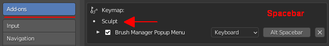
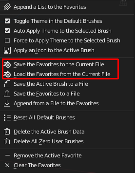
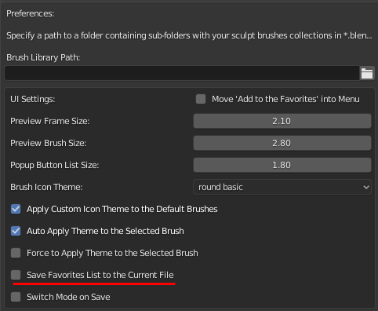

**Brushes Manager** is an add-on for Blender that helps you to create custom brushes, store them in a file and organize the library of various categories of brushes.
It also has themes for brushes preview and this add-on makes easy to apply a new themed icon for your newly created brush and for existing brushes as well.

Support Blender version: **2.83**
You can also use it for **2.90** version. It has been tested in the current build of Beta stage.

# Installation

- [**Download**](https://github.com/tingjoybits/Brush_Manager/releases/download/1.0.9/Brush_Manager109.zip)<- file
- Open Blender and select Edit->Preferences
- Click Add-ons category and then 'Install...' button
- Select the downloaded file
- Check the 'Brush Manager' option in the add-ons dialog

# Overview

**Main UI Panel:**

**Main UI Panel with the search filter turned on:**

**Menu of the Brush Manager with various operations:**

**Add-on Preferences:**

**Icon Themes:**

# Change Log:

**Brush Manager 1.0.9**

* Fix 'Paint' brush listing in 2.90 if experimental feature is turned off for the Sculpt Vertex Colors
* Other small fixes

**Brush Manager 1.0.8**

* Moved keymap for popup into the 'Sculpt' mode section. Now you can assign 'Spacebar' key only for Sculpt mode to override Preference keymap setting and it will not interfere with other modes that uses Spacebar Action ( Play, Tools, Search )
* Added keymap menu to the add-on preferences from within Blender Keymap settings.
 

**Brush Manager 1.0.7**

* New function added to save the Favorites list to the current file. (On Save include the favorites brushes in the current file data and memorize the current favorites list)
* Small fixes.

Menu operations added:

 

That way you can save the list state on demand if new preference setting has not been turned on.

Preference setting for auto saving the favorites list on file save:

**Brush Manager 1.0.5**

- First implementation of the Popup menu with a hotkey (Alt + Space)( I'm still looking forward towards Blender 2.90 release. I hope there will be a new possibility in python API for a better version of the brushes palette.)

Here you can change the hotkey if it has already using by another add-on:

New Preference setting:

**Support the Developer:**

You can support me here https://gum.co/zLBPz Thanks!
