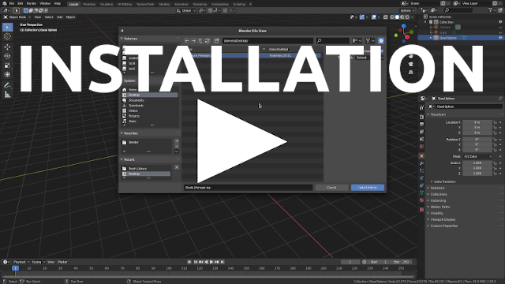
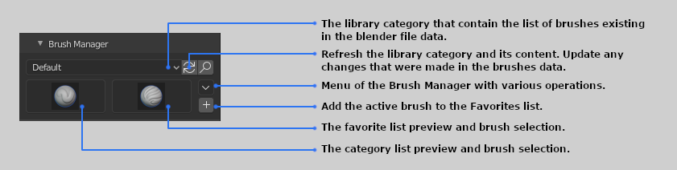
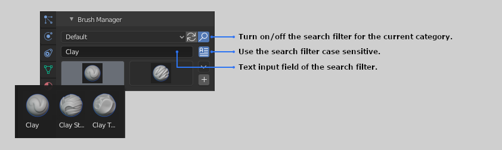
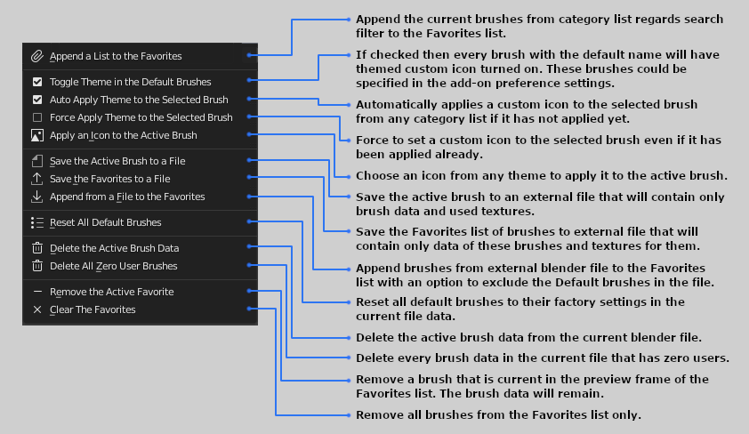
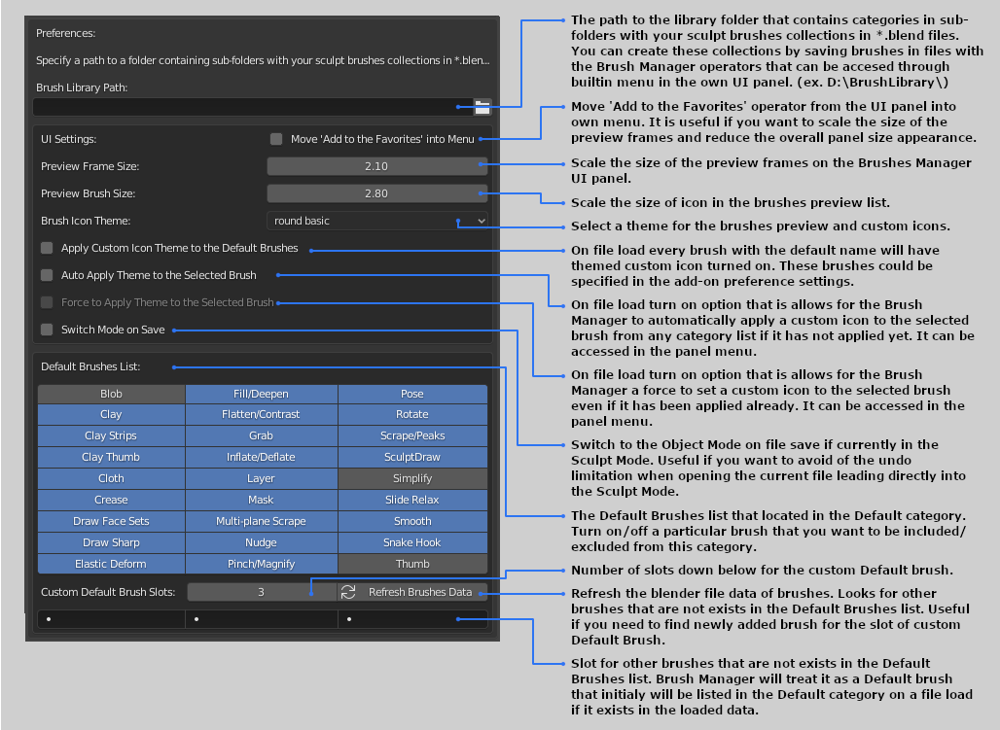
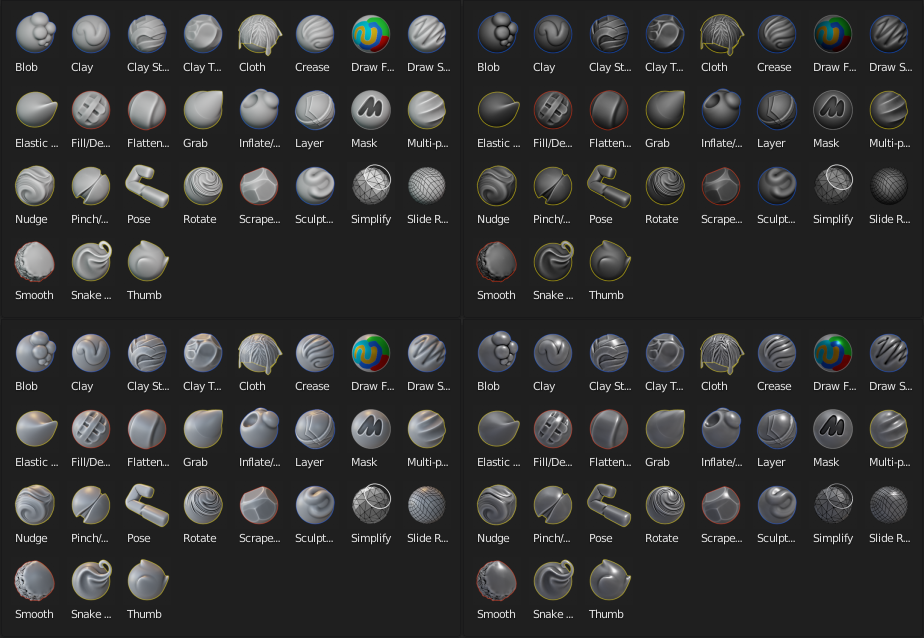
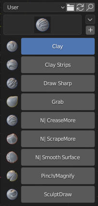
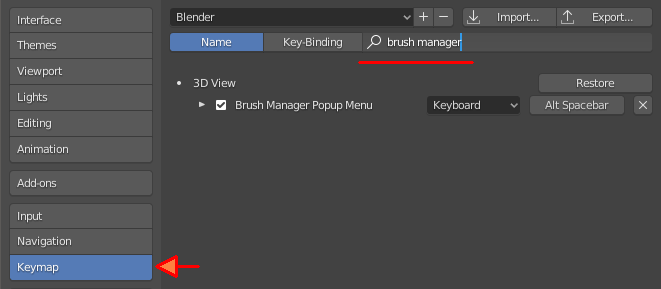
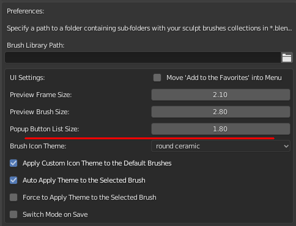

**Brushes Manager** is an add-on for Blender that helps you to create custom brushes, store them in a file and organize the library of various categories of brushes.
It also has themes for brushes preview and this add-on makes easy to apply a new themed icon for your newly created brush and for existing brushes as well.

Support Blender version: **2.83**

# Installation

- [**Download**](https://github.com/tingjoybits/Brush_Manager/releases/download/1.0.5/Brush_Manager105.zip)<- file
- Open Blender and select Edit->Preferences
- Click Add-ons category and then 'Install...' button
- Select the downloaded file
- Check the 'Brush Manager' option in the add-ons dialog

# Overview

Main UI Panel:

Main UI Panel with the search filter turned on:

Menu of the Brush Manager with various operations:

Add-on Preferences:

Icon Themes:

# Change Log:

Brush Manager 1.0.5

- First implementation of the Popup menu with a hotkey (Alt + Space)( I'm still looking forward towards Blender 2.90 release. I hope there will be a new possibility in python API for a better version of the brushes palette.)

Here you can change the hotkey if it has already using by another add-on:

New Preference setting:

**Support the Developer:**

You can support me here https://gum.co/zLBPz Thanks!
